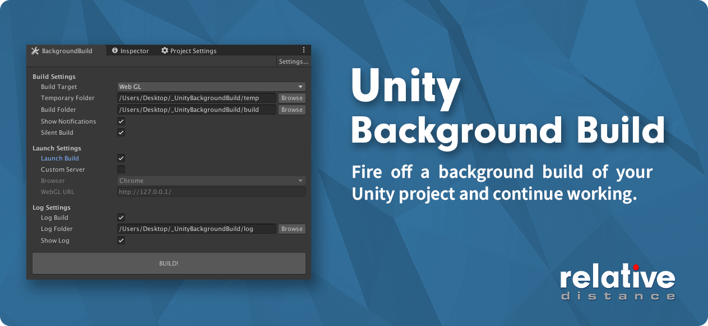

# Unity Background Build
Fire off a background build of your Unity project and continue working on the same project. Most useful for platforms that take a long time to build such as WebGL.

# How It Works
After applying your settings and pressing build, this plugin duplicates your entire current project, and then runs a silent batch mode build using the current settings and scene list.  Optionally it launches the build when complete and logs everything.  

# Installation
Import the [UnityBackgroundBuild.unitypackage](https://github.com/RelativeDistance/UnityBackgroundBuild/raw/master/Assets/UnityBackgroundBuild.unitypackage).  Then go Window->Background Build to open the editor window.  The following options are presented.

## Build Settings

#### Build Target
Select the platform to build to.  If you are building to a different platform than the one you are working on, highly recommended to be using v2 Asset Pipeline so assets won't have to be reimported.  Do at least one regular build to your selected target before a background build so your assets are cached.

#### Temporary Folder
The folder where your project is duplicated to.  Highly recommended that you have a fast SSD/NVME drive so this step is as short as possible.  This folder will be deleted before a new copy takes place, so be careful where placing it.

#### Build Folder
Folder where the project is built to.

#### Show Notifications
Shows OS level notifications for steps during the build.  Native on Mac, uses [Snoretoast](https://github.com/KDE/snoretoast) on Windows.

#### Silent Build
Build without launching the Unity editor. Should be on most of the time.  Helpful to turn off to debug issues.  Be careful because this will open up a new Unity editor that will look identical to the original, so keep tabs of which project you are working in.

## Launch Settings

#### Launch Build
Just like it says, will launch the build after completing.  

#### Custom Server (WebGL)
Turn on if you are running a custom server, if off, the standard simple server that Unity uses will launch.

#### Browser (WebGL)
Pick your browser.  If your browsers are installed in non-standard places, edit the main script.  Safari not available on Windows.  Internet explorer not available on Mac.

#### WebGL URL (WebGL)
URL to launch for custom server option.

## Log Settings

#### Log build
Output build steps to a text file.

#### Log Folder
Location of log text file.

#### Show Log
Show the log after build complete.

## TODO
- Show detailed errors in the log.
- Test other platforms besides WebGL, Windows, and Mac. May or may not work with other platforms.
- Needs testing of special characters in paths.
- Allow the use of Unity Package Manager.

